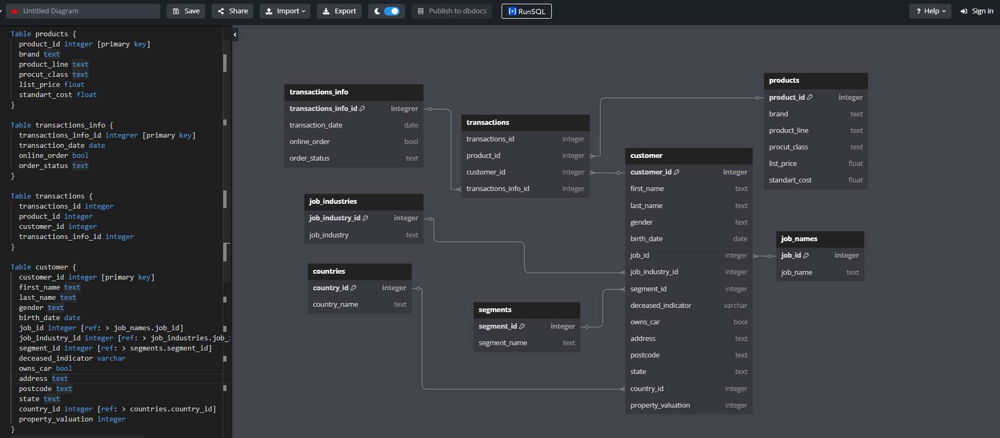
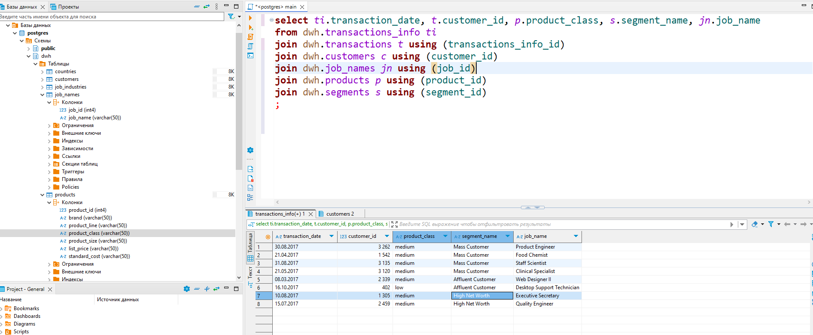

# ДЗ 1. Основы хранения данных

Первая домашняя работа на курсе по обработке и хранению данных

## Задача

Для выданного датасета:

1. Придумать структуру база данных
2. Нормализовать базу данных
3. Создать БД-шку постгрес в DBeaver
4. Загрузить таблицы с помощью бобра

## Решение

1 - 2. Я разделил данные на семантические блоки. Блок `transactions` я декомпозировал на отдельные таблицы. Блок `customer` я в целом оставил монолитным, но нормализовал отдельные подблоки с помощью зависимых таблиц. Для каждой из таблиц я определил индекс. Итоговая схема:

3 - 4. Я создал таблицы с первичными ключами для каждой таблицы. Каждую таблицу я наполнил данными в соответствии со структурой. Я ограничил тестовые данные 10 строками для удобства. Ниже - составной запрос по нескольким таблицам:

