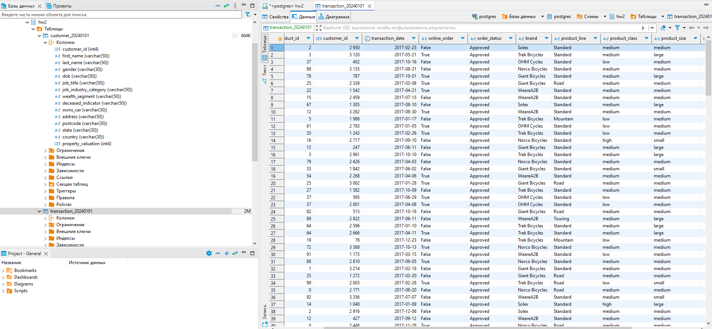

# ДЗ 2. Основы хранения данных

Вторая домашняя работа на курсе по обработке и хранению данных

## Задача

Для выданного датасета:
1. Загрузить данные в бобра
2. Вывести все уникальные бренды, у которых стандартная стоимость выше $1500$ долларов
3. Вывести все подтвержденные транзакции за период '2017-04-01' по '2017-04-09' включительно
4.  Вывести все профессии у клиентов из сферы IT или Financial Services, которые начинаются с фразы 'Senior'
5. Вывести все бренды, которые закупают клиенты, работающие в сфере Financial Services
6. Вывести $10$ клиентов, которые оформили онлайн-заказ продукции из брендов 'Giant Bicycles', 'Norco Bicycles', 'Trek Bicycles'
7. Вывести всех клиентов, у которых нет транзакций
8. Вывести всех клиентов из IT, у которых транзакции с максимальной стандартной стоимостью
9. Вывести всех клиентов из сферы IT и Health, у которых есть подтвержденные транзакции за период '2017-07-07' по '2017-07-17'

## Решение

1. Я создал схемку, в ней организовал таблицы и импортнул данные через бобра. Всё прошло без проблем


2. Уникальные бренды с ценой > 1500
```sql
select distinct brand
from hw2.transaction_20240101
where standard_cost > 1500
;
```
3. Вывести все подтвержденные транзакции за период '2017-04-01' по '2017-04-09' включительно
```sql
/* 2.1 Проверим что transaction_id - 
*		уникальный ключ
*/  
select count(transaction_id),
	count(distinct transaction_id)
from hw2.transaction_20240101
;

-- 2.2 Обновим тип даты транзакций для комфорта
alter table hw2.transaction_20240101 
alter column transaction_date
type date
using to_date(transaction_date, 'dd.mm.yyyy')

/* 2.3 Подтвержденные транзакции
*	с 1 апреля 17го по 9 апреля 17го
*/
select transaction_id
from hw2.transaction_20240101
where 1=1
and order_status = 'Approved'
and transaction_date >= '2017-04-01'
and transaction_date <= '2017-04-09'
;
```

4. Вывести все профессии у клиентов из сферы IT или Financial Services, которые начинаются с фразы 'Senior'
```sql
select distinct job_title	
from hw2.customer_20240101
where 1=1
and job_industry_category in ('IT', 'Financial Services')
and job_title like 'Senior%'
;
-- Я взял уникалов, чтобы было норм множество без дубликатов
```

5. Вывести все бренды, которые закупают клиенты, работающие в сфере Financial Services
```sql
-- 4.1 Проверим кол-во финансистов в целом и тех, которые что-то покупали
with fins as (
	select customer_id
	from hw2.customer_20240101
	where job_industry_category = 'Financial Services'
)
select (select count(distinct customer_id) from fins) "Всего финансистов",
count(distinct customer_id) "Финансистов с покупками"
from fins
join hw2.transaction_20240101 
using (customer_id)
;

-- 4.2 Бренды финансистов
with fins as (
	select customer_id
	from hw2.customer_20240101
	where job_industry_category = 'Financial Services'
)
select distinct t.brand 
from fins
join hw2.transaction_20240101 t
using (customer_id)
;
```

6. Вывести $10$ клиентов, которые оформили онлайн-заказ продукции из брендов 'Giant Bicycles', 'Norco Bicycles', 'Trek Bicycles'
```sql
select c.*
from hw2.customer_20240101 c 
join hw2.transaction_20240101 t 
using (customer_id)
where 1=1
and t.brand in ('Giant Bicycles', 'Norco Bicycles', 'Trek Bicycles')
and t.online_order::bool = true
limit 10;
```

7. Вывести всех клиентов, у которых нет транзакций
```sql
select c.*
from hw2.customer_20240101 c 
left join hw2.transaction_20240101 t 
using (customer_id)
where t.transaction_id is null
;
```

8. Вывести всех клиентов из IT, у которых транзакции с максимальной стандартной стоимостью
```sql
with max_cost as (
	select max(standard_cost) m
	from hw2.transaction_20240101
)
select c.*
from hw2.customer_20240101 c 
join hw2.transaction_20240101 t 
using (customer_id)
where 1=1 
and c.job_industry_category = 'IT'
and t.standard_cost = (select m from max_cost)
;
```

9. Вывести всех клиентов из сферы IT и Health, у которых есть подтвержденные транзакции за период '2017-07-07' по '2017-07-17'
```sql
select c.*
from hw2.customer_20240101 c 
join hw2.transaction_20240101 t 
using (customer_id)
where 1=1
and order_status = 'Approved'
and transaction_date >= '2017-07-07'
and transaction_date <= '2017-07-17'
and c.job_industry_category in ('IT', 'Health')
;
```