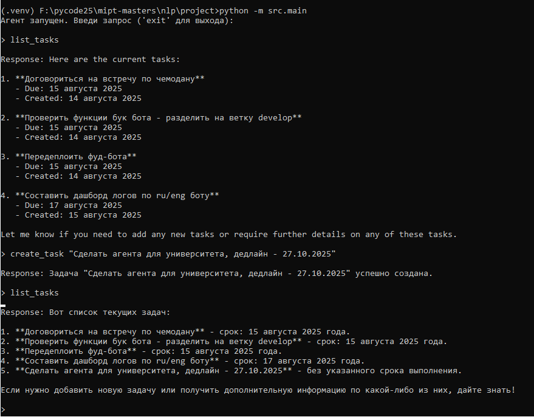
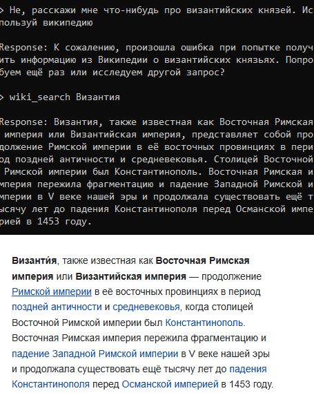

# LLM - Агент NLP

> [Ссылка на на GitHub проекта с кодом]()

MVP проактивного агента для работы с задачами и инфой из Вики, GPT-4 + LangChain

## Идея

**Цель проекта** - сделать проактивного агента, который:

- показывает текущие задачи из таск-трекера Todoist, добавляет новые задачи,
- отвечает на вопросы, используя инфу из Википедии,
- самостоятельно понимает в зависимости от запроса, какой `tool` вызвать

## Стек

Решил делать на **LangChain**. Вроде модный фреймворк, где и LLM-ку можно подключить, и tools сам будет поддерживать. В качестве LLM-ки - **GPT-4** по API, так как она стабильно работает с лангчейном и человечески даёт адекватные reasoning-ответы. Вики реализовал черел **wikipedia**-пакет

> Оказалось, что ядро LangChain меняется чуть ли не каждый месяц, в новых версиях ломаются импорты и сигнатуры 🙁 на Стаке и в обсуждениях GH полно старых примеров, которые не работают 🙁🙁 даже GPT-5 путается в API LangChain, и предлагает нерелевантные методы 🙁🙁🙁

В итоге я курил доку и собирал рабочий MVP вручную, пришлось дебажить и сравнивать changelog-и. Из-за этого агента пришлось упростить, оставить только 2 требуемых `tools`

## Структура проекта

Финальная структура выглядела так:

```markdown
project/
├── src/
├──── main.py
├──── agent/
│     ├── __init__.py
│     └── base_agent.py
├──── local_logger/
│     ├── __init__.py
│     └── local_logger.py
├──── tools/
│     ├── __init__.py
│     ├── todoist_tool.py
│     └── wiki_tool.py
├──── config/
│     ├──__init__.py
│     └── settings.py
├──── .env
├──── .gitignore
├──── requirements.txt
└──── README.md
```

Изначально задел был на ООП - и на `config/` с `local_logger/` меня хватило. Но проблемы с лангчейном убили время, поэтому под конец я перешёл к функциональщине

## Логика агента

Агент в целом строится по схеме React:

- получает запрос от пользователя,
- вызывает нужный инструмент:
  - todoist_manager для задач,
  - wiki_search для гуглинга по Вики сведений,
- возвращает и обрабатывает LLM-кой результат
- пользователь получает итоговый саммари от LLM-ки

## Проблемы и примеры

### SSL Todoist API

Todoist внезапно падал с ошибкой:

`SSLError: [SSL: UNEXPECTED_EOF_WHILE_READING]`

Решить кодом не удалось, проблема судя по всему оказалась в VPN. Без VPN Todoist API работал, но не работал OpenAI API 😭 Такие вот девопс-процессы.

Я сменил VPN endpoint, и Todoist API заработал. На примере ниже - я через агент добавил таску:



С дедлайном вышло не очень, видимо нужно допиливать эндпоинты API-шки в `tool` 🤔

### Wikipedia tool

Wikipedia-модуль работал через раз, см. скрин ниже:



Сверху - пример работы с агентом из консольки. Снизу - оригинальная статья из Вики. На примере также видно, как LLM сначала съела инфу из Вики, а потом передала её нам

## Как запустить

Чтобы протестировать агента, нужно:

1. Клонировать проект
2. Заполнить `.env` файл по примеру `.env.example`
3. `python -m venv .venv`. Активировать окружение
4. `pip install -r requirements`
5. `python -m src.main`
